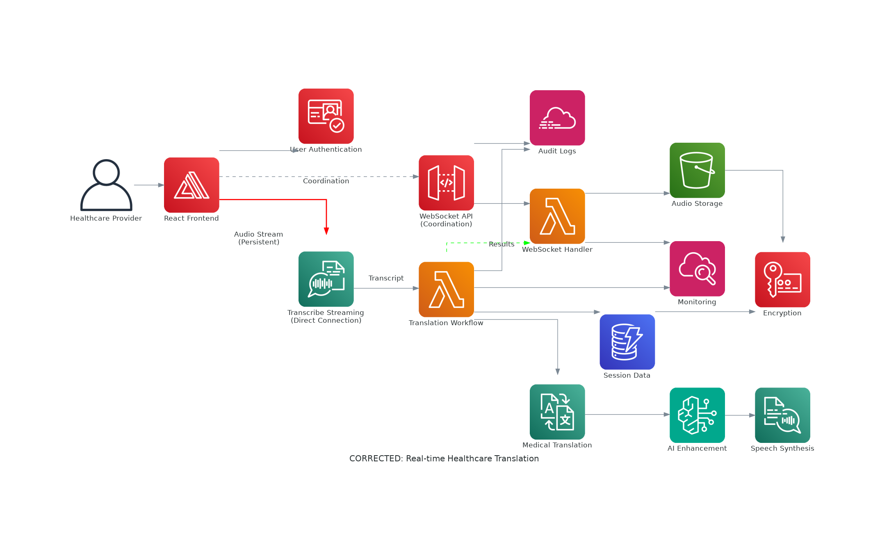
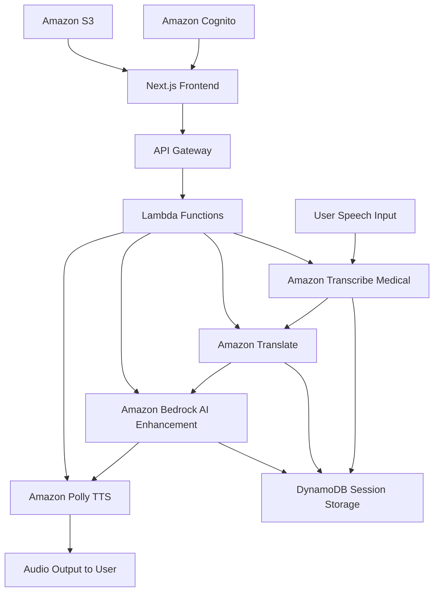

# 🏥 Healthcare Translation Web App with Generative AI

> **Breaking down language barriers in healthcare through real-time AI-powered translation**

A web-based application that enables seamless, real-time multilingual communication between patients and healthcare providers using advanced AWS AI services.

## 🎯 Project Overview

This application transforms healthcare communication by providing:
- **Real-time speech-to-text transcription** with medical terminology accuracy
- **Instant multilingual translation** powered by AI
- **Natural text-to-speech playback** for translated content
- **HIPAA-compliant** secure data handling
- **Mobile-first responsive design** for accessibility

## 🔄 How It Works

```
Patient/Doctor Speech → Transcription → Translation → AI Enhancement → Audio Playback
```

### User Journey
1. **🎤 Speak**: Patient or healthcare provider speaks in their native language
2. **📝 Transcribe**: AWS Transcribe Medical converts speech to accurate medical text
3. **🌐 Translate**: Amazon Translate processes text into target language
4. **🤖 Enhance**: Amazon Bedrock refines translation quality using generative AI
5. **🔊 Playback**: Amazon Polly converts translated text to natural speech
6. **💾 Store**: Session data securely stored for reference (HIPAA compliant)

## 🏗️ Architecture Overview

### Frontend Layer
- **Framework**: Next.js 15 with React 19
- **Hosting**: AWS Amplify Gen 2
- **Design**: Mobile-first responsive UI with Tailwind CSS
- **Features**:
  - Dual transcript display (original + translated)
  - Language selection interface
  - Audio playback controls
  - Real-time updates

### Backend Services

#### 🎯 Core AI Services
| Service | Purpose | Layer |
|---------|---------|-------|
| **Amazon Transcribe Medical** | Speech-to-text with medical accuracy | Input |
| **Amazon Translate** | Multilingual translation | Processing |
| **Amazon Bedrock** | AI-enhanced translation refinement | AI Enhancement |
| **Amazon Polly** | Text-to-speech conversion | Output |

#### 🔧 Infrastructure Services
| Service | Purpose | Function |
|---------|---------|----------|
| **AWS Amplify** | Backend orchestration & deployment | Integration |
| **Amazon Cognito** | User authentication & management | Security |
| **Amazon DynamoDB** | Translation logs & session storage | Database |
| **Amazon S3** | Audio files & static assets | Storage |
| **AWS Lambda** | Serverless processing functions | Compute |
| **Amazon API Gateway** | Secure API endpoints | Networking |

## 🚀 Key Features

### 🎨 User Interface
- **Dual Transcript Display**: Side-by-side original and translated text
- **Language Selection**: Easy dropdown for input/output languages
- **Audio Controls**: Record, play, and replay functionality
- **Responsive Design**: Optimized for mobile devices and tablets
- **Accessibility**: Screen reader compatible and keyboard navigation

### 🔒 Security & Compliance
- **HIPAA Compliance**: Secure handling of healthcare data
- **End-to-end Encryption**: Data protection in transit and at rest
- **User Authentication**: Secure login via Amazon Cognito
- **Audit Logging**: Complete session tracking for compliance

### ⚡ Performance
- **Real-time Processing**: Sub-second translation response times
- **Serverless Architecture**: Auto-scaling based on demand
- **Edge Optimization**: Global content delivery via CloudFront
- **Offline Capability**: Basic functionality without internet connection

## 🛠️ Technology Stack

### Frontend
```json
{
  "framework": "Next.js 15",
  "ui": "React 19",
  "styling": "Tailwind CSS 4",
  "language": "TypeScript 5",
  "deployment": "AWS Amplify Gen 2"
}
```

### Backend
```json
{
  "runtime": "Node.js",
  "infrastructure": "AWS CDK",
  "authentication": "Amazon Cognito",
  "database": "Amazon DynamoDB",
  "storage": "Amazon S3",
  "compute": "AWS Lambda"
}
```

## 📊 Data Flow Architecture






## 🎯 Use Cases

### Primary Users
- **Healthcare Providers**: Doctors, nurses, medical staff
- **Patients**: Non-English speaking patients and families
- **Medical Interpreters**: Professional translation verification
- **Healthcare Administrators**: Session monitoring and compliance

### Scenarios
1. **Emergency Room**: Rapid communication during critical situations
2. **Routine Checkups**: Standard patient consultations
3. **Specialist Visits**: Complex medical terminology translation
4. **Discharge Instructions**: Clear post-treatment communication
5. **Telemedicine**: Remote consultation support

## 🔧 Development Setup

### Prerequisites
- Node.js 18+ and npm
- AWS CLI configured
- AWS Amplify CLI
- TypeScript knowledge

### Quick Start
```bash
# Clone repository
git clone <repository-url>
cd translation-web-app

# Install dependencies
npm install

# Configure AWS Amplify
npx amplify configure

# Deploy backend
npx amplify push

# Start development server
npm run dev
```

## 📈 Future Enhancements

- **Multi-modal Input**: Support for text and image translation
- **Specialty Languages**: Support for sign language interpretation
- **Analytics Dashboard**: Usage statistics and performance metrics
- **Integration APIs**: Connect with existing EHR systems
- **Offline Mode**: Enhanced functionality without internet connectivity

## 🤝 Contributing

This project follows healthcare data security standards. Please review our contribution guidelines and security policies before submitting pull requests.

## 📄 License

This project is licensed under the MIT License - see the LICENSE file for details.

---

**Built with ❤️ for better healthcare communication**
