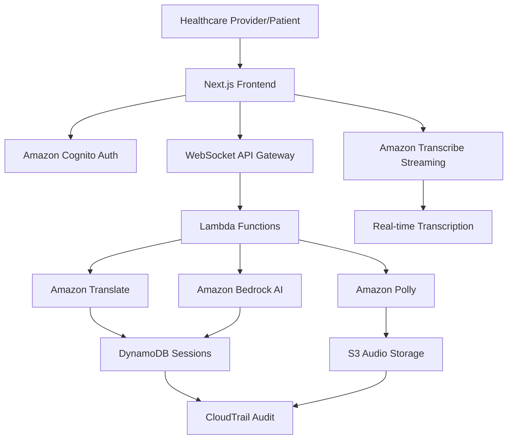

# 🏥 Healthcare Translation Web App Documentation

> **Real-time AI-powered healthcare translation with HIPAA compliance**

## 📚 Documentation Index

### Getting Started
- [Quick Start Guide](./quick-start.md) - Get up and running in minutes
- [Installation & Setup](./installation.md) - Detailed setup instructions
- [Configuration](./configuration.md) - Environment and service configuration

### Architecture & Design
- [System Architecture](./architecture.md) - High-level system design and data flow
- [AWS Services Integration](./aws-services.md) - Detailed AWS services usage
- [Database Schema](./database-schema.md) - DynamoDB tables and relationships
- [API Documentation](./api-documentation.md) - REST and WebSocket APIs

### Code Documentation
- [Frontend Components](./frontend-components.md) - React components and UI structure
- [Backend Functions](./backend-functions.md) - Lambda functions and business logic
- [Authentication & Authorization](./authentication.md) - Cognito integration and security
- [Real-time Communication](./realtime-communication.md) - WebSocket and streaming implementation

### AI & Translation Services
- [Speech-to-Text Integration](./speech-to-text.md) - Amazon Transcribe implementation
- [Translation Engine](./translation-engine.md) - Amazon Translate configuration
- [AI Enhancement](./ai-enhancement.md) - Amazon Bedrock integration
- [Text-to-Speech](./text-to-speech.md) - Amazon Polly implementation

### Security & Compliance
- [HIPAA Compliance](./hipaa-compliance.md) - Healthcare data protection measures
- [Security Architecture](./security-architecture.md) - Encryption, WAF, and access controls
- [Data Privacy](./data-privacy.md) - Data handling and retention policies
- [Audit & Logging](./audit-logging.md) - CloudTrail and monitoring setup

### Deployment & Operations
- [Deployment Guide](./deployment.md) - Production deployment procedures
- [Monitoring & Alerting](./monitoring.md) - CloudWatch dashboards and alarms
- [Troubleshooting](./troubleshooting.md) - Common issues and solutions
- [Performance Optimization](./performance.md) - Scaling and optimization strategies

### Development
- [Development Workflow](./development-workflow.md) - Local development and testing
- [Code Standards](./code-standards.md) - Coding conventions and best practices
- [Testing Strategy](./testing-strategy.md) - Unit, integration, and E2E testing
- [Contributing Guidelines](./contributing.md) - How to contribute to the project

### Reference
- [Environment Variables](./environment-variables.md) - Complete configuration reference
- [Error Codes](./error-codes.md) - Application error codes and meanings
- [Changelog](./changelog.md) - Version history and updates
- [FAQ](./faq.md) - Frequently asked questions

## 🚀 Quick Navigation

### For Developers
- [Development Setup](./installation.md#development-setup)
- [Code Structure](./frontend-components.md#code-structure)
- [API Reference](./api-documentation.md)

### For DevOps
- [Deployment Pipeline](./deployment.md#ci-cd-pipeline)
- [Infrastructure as Code](./deployment.md#infrastructure)
- [Monitoring Setup](./monitoring.md)

### For Healthcare Professionals
- [User Guide](./user-guide.md)
- [Feature Overview](./features.md)
- [Security & Privacy](./hipaa-compliance.md)

## 📋 Project Overview

This healthcare translation web application provides real-time, AI-powered translation services specifically designed for healthcare environments. The system ensures HIPAA compliance while delivering accurate medical translations through advanced AWS AI services.

### Key Features
- **Real-time Speech Translation**: Live transcription and translation during patient consultations
- **Medical Terminology Accuracy**: Specialized medical vocabulary and context understanding
- **Multi-language Support**: Support for major languages with healthcare-specific translations
- **HIPAA Compliant**: End-to-end encryption and audit logging for healthcare data protection
- **AI Enhancement**: Advanced AI refinement of translations for medical accuracy
- **Natural Speech Output**: High-quality text-to-speech for translated content

### Technology Stack
- **Frontend**: Next.js 15, React 19, TypeScript, Tailwind CSS
- **Backend**: AWS Amplify Gen 2, Lambda Functions, API Gateway
- **AI Services**: Amazon Transcribe, Translate, Bedrock, Polly
- **Database**: Amazon DynamoDB
- **Storage**: Amazon S3
- **Authentication**: Amazon Cognito
- **Security**: AWS WAF, KMS, CloudTrail

## 🏗️ Architecture Overview

## 📞 Support & Contact

- **Documentation Issues**: Create an issue in the repository
- **Technical Support**: Contact the development team
- **Security Concerns**: Follow responsible disclosure guidelines

---

**Last Updated**: September 2024  
**Version**: 1.0.0  
**Maintained by**: Healthcare Translation Team
