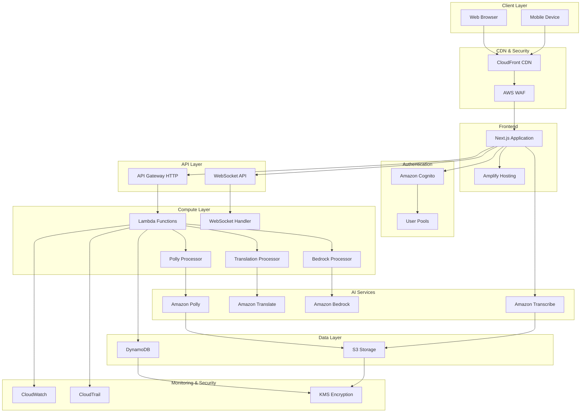
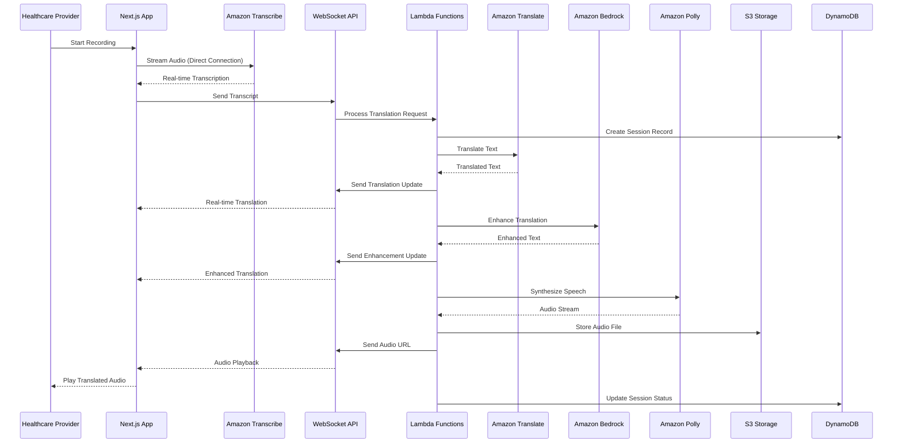
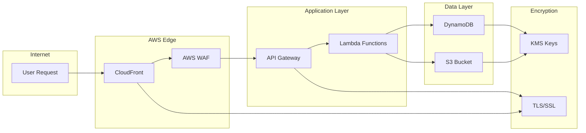
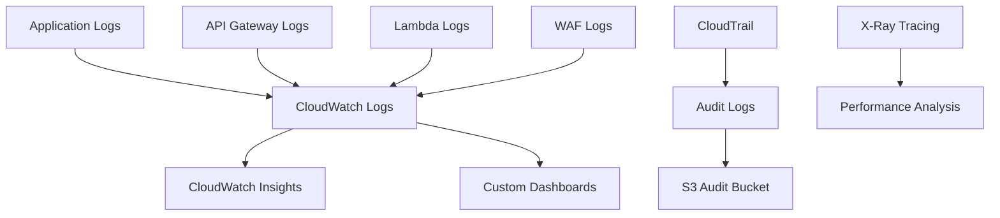
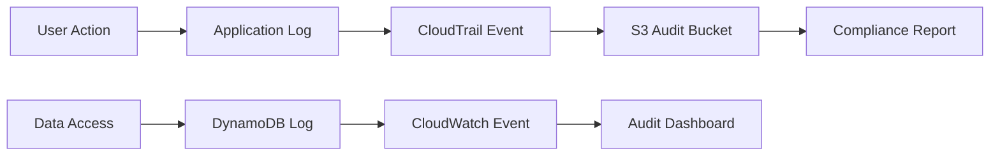

# System Architecture

## Overview

The Healthcare Translation Web Application follows a serverless, event-driven architecture built on AWS services. The system is designed for real-time performance, HIPAA compliance, and scalability.

## High-Level Architecture



## Data Flow Architecture

### Real-time Translation Flow



## Component Architecture

### Frontend Architecture

```
src/
├── app/                    # Next.js App Router
│   ├── layout.tsx         # Root layout with providers
│   ├── page.tsx           # Main translation interface
│   └── auth/              # Authentication pages
├── components/            # Reusable UI components
│   ├── ErrorBoundary.tsx  # Error handling
│   └── LoadingSpinner.tsx # Loading states
├── context/               # React Context providers
│   └── AppContext.tsx     # Global application state
├── types/                 # TypeScript type definitions
│   └── translation.ts     # Translation-related types
└── amplify/               # Amplify configuration
    ├── client.ts          # Amplify client setup
    └── config.ts          # Configuration loader
```

### Backend Architecture

```
amplify/
├── backend.ts             # Main backend configuration
├── auth/                  # Authentication resources
│   └── resource.ts        # Cognito configuration
├── data/                  # Database resources
│   └── resource.ts        # DynamoDB schema
├── storage/               # Storage resources
│   └── resource.ts        # S3 bucket configuration
└── functions/             # Lambda functions
    ├── transcribe-connection/  # Transcribe WebSocket handler
    ├── websocket-handler/      # WebSocket connection manager
    ├── translate-processor/    # Translation service
    ├── bedrock-processor/      # AI enhancement service
    └── polly-processor/        # Text-to-speech service
```

## Service Integration Patterns

### 1. Direct Client Integration
- **Amazon Transcribe Streaming**: Direct WebSocket connection from frontend
- **Benefits**: Low latency, real-time streaming, reduced Lambda costs
- **Implementation**: Signed URL generation via Lambda, direct client connection

### 2. API Gateway Integration
- **HTTP API**: RESTful endpoints for translation services
- **WebSocket API**: Real-time communication for coordination
- **Benefits**: Centralized routing, authentication, rate limiting

### 3. Event-Driven Processing
- **Lambda Functions**: Serverless compute for each AI service
- **Benefits**: Auto-scaling, pay-per-use, service isolation
- **Pattern**: Single-purpose functions with clear responsibilities

## Scalability Considerations

### Horizontal Scaling
- **Lambda Concurrency**: Auto-scaling based on demand
- **API Gateway**: Built-in scaling and throttling
- **DynamoDB**: On-demand scaling for read/write capacity

### Performance Optimization
- **CloudFront CDN**: Global content delivery
- **Connection Pooling**: Reuse of AWS service connections
- **Caching**: Strategic caching of translation results

### Cost Optimization
- **Direct Transcribe Connection**: Bypasses Lambda for streaming
- **On-Demand Resources**: Pay-per-use model for all services
- **Efficient Data Storage**: Optimized DynamoDB and S3 usage

## Security Architecture

### Network Security


### Data Protection Layers
1. **Transport Encryption**: TLS 1.3 for all communications
2. **Application Encryption**: KMS encryption for sensitive data
3. **Storage Encryption**: Encrypted at rest in DynamoDB and S3
4. **Access Control**: IAM roles with least privilege principle

## Monitoring & Observability

### Logging Architecture


### Metrics Collection
- **Application Metrics**: Custom CloudWatch metrics
- **Infrastructure Metrics**: AWS service metrics
- **Business Metrics**: Translation accuracy, session duration
- **Security Metrics**: Failed authentication attempts, suspicious activity

## Disaster Recovery

### Backup Strategy
- **DynamoDB**: Point-in-time recovery enabled
- **S3**: Cross-region replication for critical audio files
- **Configuration**: Infrastructure as Code for rapid rebuilding

### High Availability
- **Multi-AZ Deployment**: Services deployed across availability zones
- **Auto-Failover**: Built-in AWS service redundancy
- **Health Checks**: Automated monitoring and alerting

## Compliance Architecture

### HIPAA Compliance Features
- **Encryption**: End-to-end encryption of PHI
- **Access Logging**: Complete audit trail of data access
- **Data Retention**: Configurable retention policies
- **User Authentication**: Strong authentication requirements

### Audit Trail


## Technology Decisions

### Why Serverless?
- **Scalability**: Automatic scaling based on demand
- **Cost Efficiency**: Pay only for actual usage
- **Maintenance**: Reduced operational overhead
- **Security**: Built-in security features and compliance

### Why Direct Transcribe Connection?
- **Latency**: Eliminates Lambda cold starts for streaming
- **Cost**: Reduces Lambda invocation costs for long sessions
- **Reliability**: Direct connection reduces failure points
- **Performance**: Optimized for real-time audio streaming

### Why Event-Driven Architecture?
- **Decoupling**: Services can evolve independently
- **Resilience**: Failure isolation between components
- **Scalability**: Each service scales based on its own demand
- **Maintainability**: Clear separation of concerns
