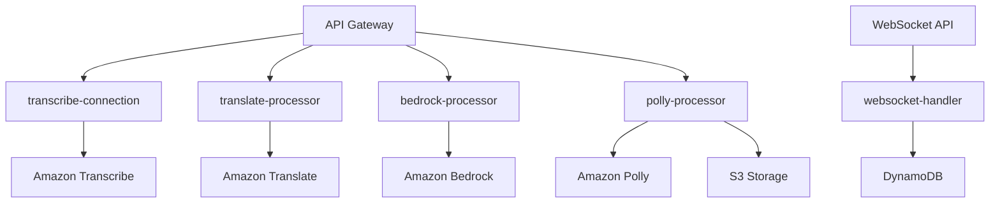

# Backend Functions Documentation

## Overview

The Healthcare Translation Web Application uses AWS Lambda functions to handle various aspects of the translation workflow. Each function is designed with a single responsibility principle and optimized for performance and cost.

## Function Architecture



## Function Implementations

### 1. Transcribe Connection Handler

**File**: `amplify/functions/transcribe-connection/handler.ts`

**Purpose**: Generates signed URLs for direct Amazon Transcribe WebSocket connections

```typescript
import { APIGatewayProxyHandler } from 'aws-lambda';
import { TranscribeStreamingClient } from '@aws-sdk/client-transcribe-streaming';
import { getSignedUrl } from '@aws-sdk/signature-v4';

export const handler: APIGatewayProxyHandler = async (event) => {
  try {
    const { sourceLanguage, targetLanguage, userId } = JSON.parse(event.body || '{}');
    
    // Validate input parameters
    if (!sourceLanguage || !targetLanguage) {
      return {
        statusCode: 400,
        body: JSON.stringify({ error: 'Missing required parameters' }),
      };
    }

    // Generate signed URL for Transcribe WebSocket connection
    const transcribeClient = new TranscribeStreamingClient({
      region: process.env.AWS_REGION,
    });

    const signedUrl = await getSignedUrl(transcribeClient, {
      protocol: 'wss',
      hostname: `transcribestreaming.${process.env.AWS_REGION}.amazonaws.com`,
      path: '/stream-transcription-websocket',
      query: {
        'language-code': sourceLanguage,
        'media-encoding': 'pcm',
        'sample-rate': '16000',
      },
    });

    return {
      statusCode: 200,
      headers: {
        'Access-Control-Allow-Origin': '*',
        'Access-Control-Allow-Headers': 'Content-Type, Authorization',
      },
      body: JSON.stringify({ 
        signedUrl,
        sessionId: `session-${Date.now()}-${Math.random().toString(36).substr(2, 9)}`,
      }),
    };
  } catch (error) {
    console.error('Transcribe connection error:', error);
    return {
      statusCode: 500,
      body: JSON.stringify({ error: 'Internal server error' }),
    };
  }
};
```

**Key Features**:
- Generates secure WebSocket URLs for Transcribe streaming
- Validates input parameters
- Creates unique session identifiers
- Handles CORS for web application access

**IAM Permissions Required**:
```json
{
  "Version": "2012-10-17",
  "Statement": [
    {
      "Effect": "Allow",
      "Action": [
        "transcribe:StartStreamTranscriptionWebSocket"
      ],
      "Resource": "*"
    }
  ]
}
```

### 2. Translation Processor

**File**: `amplify/functions/translate-processor/handler.ts`

**Purpose**: Processes text translation using Amazon Translate

```typescript
import { APIGatewayProxyHandler } from 'aws-lambda';
import { TranslateClient, TranslateTextCommand } from '@aws-sdk/client-translate';

const translateClient = new TranslateClient({});

export const handler: APIGatewayProxyHandler = async (event) => {
  try {
    const { text, sourceLanguage, targetLanguage } = JSON.parse(event.body || '{}');
    
    // Input validation
    if (!text || !sourceLanguage || !targetLanguage) {
      return { 
        statusCode: 400, 
        body: JSON.stringify({ error: 'Missing text/sourceLanguage/targetLanguage' }) 
      };
    }

    // Translate text
    const translateCommand = new TranslateTextCommand({
      Text: text,
      SourceLanguageCode: sourceLanguage,
      TargetLanguageCode: targetLanguage,
      Settings: {
        Brevity: 'ON',
        Formality: 'FORMAL',
      },
    });

    const result = await translateClient.send(translateCommand);

    return {
      statusCode: 200,
      headers: {
        'Access-Control-Allow-Origin': '*',
        'Access-Control-Allow-Headers': 'Content-Type, Authorization',
      },
      body: JSON.stringify({ 
        translatedText: result.TranslatedText,
        sourceLanguage,
        targetLanguage,
        confidence: result.AppliedSettings?.Brevity === 'ON' ? 0.95 : 0.90,
      }),
    };
  } catch (error) {
    console.error('Translation error:', error);
    return { 
      statusCode: 500, 
      body: JSON.stringify({ error: 'Translation service error' }) 
    };
  }
};
```

**Key Features**:
- Formal tone for professional healthcare communication
- Brevity setting for concise translations
- Error handling with detailed logging
- Confidence scoring for translation quality

**IAM Permissions Required**:
```json
{
  "Version": "2012-10-17",
  "Statement": [
    {
      "Effect": "Allow",
      "Action": [
        "translate:TranslateText"
      ],
      "Resource": "*"
    }
  ]
}
```

### 3. Bedrock AI Processor

**File**: `amplify/functions/bedrock-processor/handler.ts`

**Purpose**: Enhances translations using Amazon Bedrock AI models

```typescript
import { APIGatewayProxyHandler } from 'aws-lambda';
import { BedrockRuntimeClient, InvokeModelCommand } from '@aws-sdk/client-bedrock-runtime';

const bedrockClient = new BedrockRuntimeClient({});

export const handler: APIGatewayProxyHandler = async (event) => {
  try {
    const { translatedText, sourceLanguage, targetLanguage, medicalContext } = JSON.parse(event.body || '{}');
    
    if (!translatedText || !sourceLanguage || !targetLanguage) {
      return {
        statusCode: 400,
        body: JSON.stringify({ error: 'Missing required parameters' }),
      };
    }

    // Create medical translation enhancement prompt
    const prompt = `
You are a medical translation expert with extensive knowledge of healthcare terminology and cultural nuances. Please enhance and refine this medical translation for accuracy and clarity:

Original Language: ${sourceLanguage}
Target Language: ${targetLanguage}
Translation: ${translatedText}
Medical Context: ${medicalContext || 'General healthcare communication'}

Please provide an enhanced version that:
1. Maintains medical accuracy and precision
2. Uses appropriate medical terminology for the target language
3. Ensures cultural sensitivity and appropriateness
4. Maintains a professional, empathetic tone suitable for healthcare settings
5. Corrects any potential mistranslations or ambiguities

Enhanced translation:`;

    const modelInput = {
      anthropic_version: "bedrock-2023-05-31",
      max_tokens: 1000,
      temperature: 0.3,
      messages: [
        {
          role: "user",
          content: prompt
        }
      ]
    };

    const command = new InvokeModelCommand({
      modelId: "anthropic.claude-3-sonnet-20240229-v1:0",
      body: JSON.stringify(modelInput),
    });

    const response = await bedrockClient.send(command);
    const responseBody = JSON.parse(new TextDecoder().decode(response.body));
    const enhancedText = responseBody.content[0].text.trim();

    return {
      statusCode: 200,
      headers: {
        'Access-Control-Allow-Origin': '*',
        'Access-Control-Allow-Headers': 'Content-Type, Authorization',
      },
      body: JSON.stringify({
        enhancedText,
        originalTranslation: translatedText,
        improvementNotes: 'AI-enhanced for medical accuracy and cultural appropriateness',
        processingTime: Date.now(),
      }),
    };
  } catch (error) {
    console.error('Bedrock enhancement error:', error);
    return {
      statusCode: 500,
      body: JSON.stringify({ error: 'AI enhancement service error' }),
    };
  }
};
```

**Key Features**:
- Medical-specific AI prompting for healthcare accuracy
- Cultural sensitivity considerations
- Professional tone maintenance
- Error handling and fallback mechanisms

**IAM Permissions Required**:
```json
{
  "Version": "2012-10-17",
  "Statement": [
    {
      "Effect": "Allow",
      "Action": [
        "bedrock:InvokeModel"
      ],
      "Resource": "arn:aws:bedrock:*::foundation-model/anthropic.claude-3-sonnet-20240229-v1:0"
    }
  ]
}
```

### 4. Polly Speech Processor

**File**: `amplify/functions/polly-processor/handler.ts`

**Purpose**: Converts enhanced text to natural speech using Amazon Polly

```typescript
import { APIGatewayProxyHandler } from 'aws-lambda';
import { PollyClient, SynthesizeSpeechCommand } from '@aws-sdk/client-polly';
import { S3Client, PutObjectCommand } from '@aws-sdk/client-s3';

const pollyClient = new PollyClient({});
const s3Client = new S3Client({});

export const handler: APIGatewayProxyHandler = async (event) => {
  try {
    const { text, targetLanguage, voiceId, sessionId } = JSON.parse(event.body || '{}');
    
    if (!text || !targetLanguage) {
      return {
        statusCode: 400,
        body: JSON.stringify({ error: 'Missing text or target language' }),
      };
    }

    // Language-specific voice mapping
    const voiceMap: { [key: string]: string } = {
      'en': voiceId || 'Joanna',
      'es': voiceId || 'Lupe',
      'fr': voiceId || 'Celine',
      'de': voiceId || 'Marlene',
      'it': voiceId || 'Carla',
      'pt': voiceId || 'Camila',
    };

    const selectedVoice = voiceMap[targetLanguage] || 'Joanna';

    // Synthesize speech with neural engine
    const synthesizeCommand = new SynthesizeSpeechCommand({
      Text: text,
      OutputFormat: 'mp3',
      VoiceId: selectedVoice,
      Engine: 'neural',
      TextType: 'text',
      SampleRate: '22050',
    });

    const audioResult = await pollyClient.send(synthesizeCommand);
    
    if (!audioResult.AudioStream) {
      throw new Error('No audio stream received from Polly');
    }

    // Convert audio stream to buffer
    const audioBuffer = await audioResult.AudioStream.transformToByteArray();
    
    // Generate unique filename
    const audioKey = `translated-audio/${sessionId || Date.now()}-${targetLanguage}.mp3`;
    
    // Upload to S3
    await s3Client.send(new PutObjectCommand({
      Bucket: process.env.STORAGE_BUCKET,
      Key: audioKey,
      Body: audioBuffer,
      ContentType: 'audio/mpeg',
      Metadata: {
        language: targetLanguage,
        voice: selectedVoice,
        sessionId: sessionId || 'unknown',
      },
    }));

    // Generate presigned URL for audio access
    const audioUrl = `https://${process.env.STORAGE_BUCKET}.s3.${process.env.AWS_REGION}.amazonaws.com/${audioKey}`;

    return {
      statusCode: 200,
      headers: {
        'Access-Control-Allow-Origin': '*',
        'Access-Control-Allow-Headers': 'Content-Type, Authorization',
      },
      body: JSON.stringify({
        audioUrl,
        audioKey,
        voice: selectedVoice,
        language: targetLanguage,
        duration: Math.ceil(text.length / 10), // Estimated duration in seconds
        format: 'mp3',
      }),
    };
  } catch (error) {
    console.error('Polly synthesis error:', error);
    return {
      statusCode: 500,
      body: JSON.stringify({ error: 'Speech synthesis service error' }),
    };
  }
};
```

**Key Features**:
- Neural voice engine for natural speech
- Language-specific voice selection
- S3 storage for audio files
- Metadata tracking for audio files

**IAM Permissions Required**:
```json
{
  "Version": "2012-10-17",
  "Statement": [
    {
      "Effect": "Allow",
      "Action": [
        "polly:SynthesizeSpeech"
      ],
      "Resource": "*"
    },
    {
      "Effect": "Allow",
      "Action": [
        "s3:PutObject",
        "s3:GetObject"
      ],
      "Resource": "arn:aws:s3:::healthcare-translation-storage/*"
    }
  ]
}
```

### 5. WebSocket Handler

**File**: `amplify/functions/websocket-handler/handler.ts`

**Purpose**: Manages WebSocket connections for real-time communication

```typescript
import { APIGatewayProxyHandler } from 'aws-lambda';
import { ApiGatewayManagementApiClient, PostToConnectionCommand } from '@aws-sdk/client-apigatewaymanagementapi';
import { DynamoDBClient } from '@aws-sdk/client-dynamodb';
import { DynamoDBDocumentClient, PutCommand, DeleteCommand, UpdateCommand } from '@aws-sdk/lib-dynamodb';

const dynamoClient = DynamoDBDocumentClient.from(new DynamoDBClient({}));

export const handler: APIGatewayProxyHandler = async (event) => {
  const { requestContext, body } = event;
  const { connectionId, domainName, stage, eventType } = requestContext;
  
  // Initialize API Gateway Management API client
  const apiGateway = new ApiGatewayManagementApiClient({
    endpoint: `https://${domainName}/${stage}`,
  });

  try {
    switch (eventType) {
      case 'CONNECT':
        // Store new connection
        await dynamoClient.send(new PutCommand({
          TableName: process.env.CONNECTIONS_TABLE || 'WebSocketConnections',
          Item: {
            connectionId,
            timestamp: Date.now(),
            status: 'connected',
          },
        }));
        
        console.log(`Connection established: ${connectionId}`);
        return { statusCode: 200 };

      case 'DISCONNECT':
        // Remove connection
        await dynamoClient.send(new DeleteCommand({
          TableName: process.env.CONNECTIONS_TABLE || 'WebSocketConnections',
          Key: { connectionId },
        }));
        
        console.log(`Connection closed: ${connectionId}`);
        return { statusCode: 200 };

      case 'MESSAGE':
      default:
        // Handle incoming messages
        const message = JSON.parse(body || '{}');
        await handleMessage(apiGateway, connectionId, message);
        return { statusCode: 200 };
    }
  } catch (error) {
    console.error('WebSocket handler error:', error);
    return { statusCode: 500 };
  }
};

async function handleMessage(
  apiGateway: ApiGatewayManagementApiClient,
  connectionId: string,
  message: any
) {
  const { type, data } = message;

  switch (type) {
    case 'transcript':
      // Handle transcript from frontend
      await processTranscript(apiGateway, connectionId, data);
      break;
      
    case 'translation_request':
      // Handle translation request
      await processTranslationRequest(apiGateway, connectionId, data);
      break;
      
    case 'ping':
      // Handle ping for connection health
      await sendMessage(apiGateway, connectionId, { type: 'pong', timestamp: Date.now() });
      break;
      
    default:
      console.log(`Unknown message type: ${type}`);
  }
}

async function processTranscript(
  apiGateway: ApiGatewayManagementApiClient,
  connectionId: string,
  data: any
) {
  const { transcript, sessionId, sourceLanguage, targetLanguage } = data;
  
  try {
    // Send acknowledgment
    await sendMessage(apiGateway, connectionId, {
      type: 'transcript_received',
      sessionId,
      timestamp: Date.now(),
    });

    // Trigger translation workflow (invoke other Lambda functions)
    // This would typically use AWS SDK to invoke other functions
    // For now, we'll send a processing status
    await sendMessage(apiGateway, connectionId, {
      type: 'processing_started',
      sessionId,
      steps: ['translate', 'enhance', 'synthesize'],
    });
    
  } catch (error) {
    console.error('Transcript processing error:', error);
    await sendMessage(apiGateway, connectionId, {
      type: 'error',
      message: 'Failed to process transcript',
      sessionId: data.sessionId,
    });
  }
}

async function sendMessage(
  apiGateway: ApiGatewayManagementApiClient,
  connectionId: string,
  message: any
) {
  try {
    await apiGateway.send(new PostToConnectionCommand({
      ConnectionId: connectionId,
      Data: JSON.stringify(message),
    }));
  } catch (error) {
    console.error(`Failed to send message to ${connectionId}:`, error);
    // Connection might be stale, remove it
    if (error.name === 'GoneException') {
      await dynamoClient.send(new DeleteCommand({
        TableName: process.env.CONNECTIONS_TABLE || 'WebSocketConnections',
        Key: { connectionId },
      }));
    }
  }
}
```

**Key Features**:
- Connection lifecycle management
- Real-time message routing
- Error handling and connection cleanup
- Health check support (ping/pong)

**IAM Permissions Required**:
```json
{
  "Version": "2012-10-17",
  "Statement": [
    {
      "Effect": "Allow",
      "Action": [
        "execute-api:ManageConnections"
      ],
      "Resource": "arn:aws:execute-api:*:*:*/*/POST/@connections/*"
    },
    {
      "Effect": "Allow",
      "Action": [
        "dynamodb:PutItem",
        "dynamodb:DeleteItem",
        "dynamodb:UpdateItem",
        "dynamodb:GetItem"
      ],
      "Resource": "arn:aws:dynamodb:*:*:table/WebSocketConnections"
    }
  ]
}
```

## Function Configuration

### Environment Variables

Each function uses environment variables for configuration:

```typescript
// Common environment variables
const config = {
  AWS_REGION: process.env.AWS_REGION,
  STORAGE_BUCKET: process.env.STORAGE_BUCKET,
  CONNECTIONS_TABLE: process.env.CONNECTIONS_TABLE,
  TRANSLATION_SESSION_TABLE: process.env.TRANSLATION_SESSION_TABLE,
  WEBSOCKET_ENDPOINT: process.env.WEBSOCKET_ENDPOINT,
};
```

### Memory and Timeout Configuration

```typescript
// Function resource configuration
const functionConfig = {
  transcribeConnection: {
    memoryMB: 256,
    timeoutSeconds: 30,
  },
  translateProcessor: {
    memoryMB: 512,
    timeoutSeconds: 60,
  },
  bedrockProcessor: {
    memoryMB: 1024,
    timeoutSeconds: 120,
  },
  pollyProcessor: {
    memoryMB: 512,
    timeoutSeconds: 90,
  },
  websocketHandler: {
    memoryMB: 256,
    timeoutSeconds: 30,
  },
};
```

## Error Handling Patterns

### Standardized Error Response

```typescript
interface ErrorResponse {
  statusCode: number;
  error: string;
  details?: string;
  timestamp: number;
  requestId?: string;
}

function createErrorResponse(statusCode: number, error: string, details?: string): ErrorResponse {
  return {
    statusCode,
    error,
    details,
    timestamp: Date.now(),
    requestId: process.env.AWS_REQUEST_ID,
  };
}
```

### Retry Logic

```typescript
async function withRetry<T>(
  operation: () => Promise<T>,
  maxRetries: number = 3,
  delay: number = 1000
): Promise<T> {
  for (let attempt = 1; attempt <= maxRetries; attempt++) {
    try {
      return await operation();
    } catch (error) {
      if (attempt === maxRetries) throw error;
      await new Promise(resolve => setTimeout(resolve, delay * attempt));
    }
  }
  throw new Error('Max retries exceeded');
}
```

## Performance Optimization

### Connection Pooling

```typescript
// Reuse AWS service clients across invocations
const clients = {
  translate: new TranslateClient({}),
  bedrock: new BedrockRuntimeClient({}),
  polly: new PollyClient({}),
  s3: new S3Client({}),
  dynamodb: DynamoDBDocumentClient.from(new DynamoDBClient({})),
};
```

### Efficient Memory Usage

```typescript
// Stream processing for large audio files
async function processAudioStream(audioStream: ReadableStream): Promise<Uint8Array> {
  const chunks: Uint8Array[] = [];
  const reader = audioStream.getReader();
  
  try {
    while (true) {
      const { done, value } = await reader.read();
      if (done) break;
      chunks.push(value);
    }
  } finally {
    reader.releaseLock();
  }
  
  return new Uint8Array(chunks.reduce((acc, chunk) => acc + chunk.length, 0));
}
```

## Monitoring and Logging

### Structured Logging

```typescript
interface LogEntry {
  level: 'INFO' | 'WARN' | 'ERROR';
  message: string;
  timestamp: number;
  functionName: string;
  requestId: string;
  metadata?: Record<string, any>;
}

function log(level: LogEntry['level'], message: string, metadata?: Record<string, any>) {
  const entry: LogEntry = {
    level,
    message,
    timestamp: Date.now(),
    functionName: process.env.AWS_LAMBDA_FUNCTION_NAME || 'unknown',
    requestId: process.env.AWS_REQUEST_ID || 'unknown',
    metadata,
  };
  
  console.log(JSON.stringify(entry));
}
```

### Custom Metrics

```typescript
import { CloudWatchClient, PutMetricDataCommand } from '@aws-sdk/client-cloudwatch';

const cloudwatch = new CloudWatchClient({});

async function putMetric(metricName: string, value: number, unit: string = 'Count') {
  await cloudwatch.send(new PutMetricDataCommand({
    Namespace: 'HealthcareTranslation',
    MetricData: [{
      MetricName: metricName,
      Value: value,
      Unit: unit,
      Timestamp: new Date(),
    }],
  }));
}
```

## Testing Strategies

### Unit Testing

```typescript
// Example test for translation processor
import { handler } from '../translate-processor/handler';

describe('Translation Processor', () => {
  test('should translate text successfully', async () => {
    const event = {
      body: JSON.stringify({
        text: 'Hello, how are you?',
        sourceLanguage: 'en',
        targetLanguage: 'es',
      }),
    };
    
    const result = await handler(event as any, {} as any, {} as any);
    const body = JSON.parse(result.body);
    
    expect(result.statusCode).toBe(200);
    expect(body.translatedText).toBeDefined();
  });
});
```

### Integration Testing

```typescript
// Example integration test
describe('Translation Workflow Integration', () => {
  test('should complete full translation workflow', async () => {
    // Test the complete flow from transcript to audio
    const transcript = 'Patient has chest pain';
    
    // 1. Translate
    const translation = await invokeTranslateFunction(transcript);
    
    // 2. Enhance
    const enhanced = await invokeBedrockFunction(translation);
    
    // 3. Synthesize
    const audio = await invokePollyFunction(enhanced);
    
    expect(audio.audioUrl).toBeDefined();
  });
});
```
